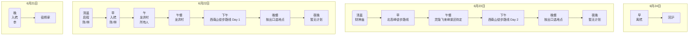

# 1. 总旅行计划一览

* 初步计划
    * 因寺庙预约的问题, 行程可能会变动
    * 因私家车单双号限行问题, 行程可能会变动

```mermaid
graph TD
    subgraph Day624["6月24日"]
        24morn["早<br> 离杭"];
        24noon["回沪"];
        24morn --> 24noon;
    end
    subgraph Day623["6月23日"]
        23earlymorn(清晨<br> 财神庙);
        23morn["早<br> 北高峰徒步路线"];
        23lunch["午餐<br> 灵隐飞来峰景区待定"];
        23aftern["下午<br> 西南山徒步路线 Day 2"];
        23dinner["晚餐<br> 按出口选地点"];
        23even["夜晚<br> 暂无计划"];
        23earlymorn --> 23morn;
        23morn --> 23lunch;
        23lunch --> 23aftern;
        23aftern --> 23dinner;
        23dinner --> 23even;
    end
    subgraph Day622["6月22日"]
        22earlymorn(清晨<br> 启程 <br> 陈/林);
        22morn("早<br> 入杭 <br> 陈/林");
        22noon["午<br> 龙井村 <br> 所有人"];
        22lunch["午餐<br> 龙井村"];
        22aftern["下午<br> 西南山徒步路线 Day 1"];
        22dinner["晚餐<br> 按出口选地点"];
        22even["夜晚<br> 暂无计划"];
        22earlymorn --> 22morn;
        22morn --> 22noon;
        22noon --> 22lunch
        22lunch --> 22aftern;
        22aftern --> 22dinner;
        22dinner --> 22even;
    end
    subgraph Day621["6月21日"]
        21morn("晚<br> 入杭 <br> 李");
        21even["宿杨家"];
        21morn --> 21even;
    end
```
